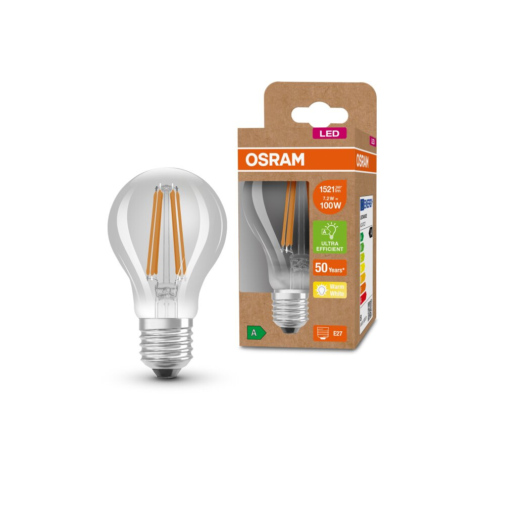

## A) Photo : ajouter la sécurité `rel` pour `target="_blank"`
- Vous utilisez `target="_blank"` sur la photo
- Veuillez ajouter `rel="noopener noreferrer"`
- Exemple :
```
<a href="./img/portait.jpg" target="_blank" rel="noopener noreferrer">
  
</a>
```

## B) Footer : ajouter l’e-mail en `mailto:`
- Veuillez ajouter votre e-mail dans le footer et le rendre cliquable
- Exemple :
```
<footer>
  &copy;2025 Prénom Nom —
  <a href="mailto:prenom.nom@email.com">prenom.nom@email.com</a>
</footer>
```
